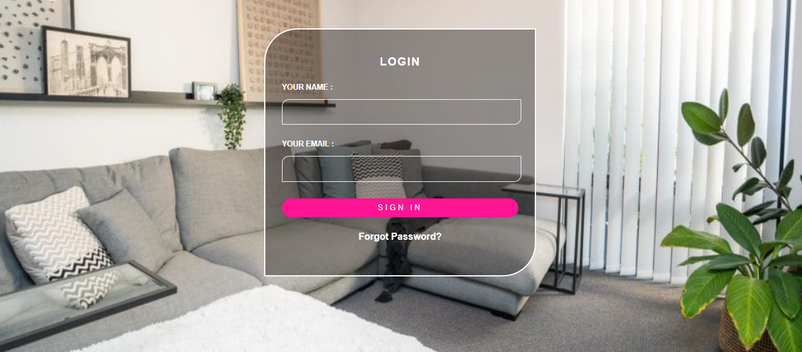

# Tela de Login Simples

Este é um projeto simples de uma tela de login criada com HTML e CSS.

## Descrição

Este projeto consiste em uma tela de login básica desenvolvida. É um exemplo simples de como criar uma interface de usuário para autenticação.

## Visualização

Você pode ver o resultado final do desafio [aqui](https://alberesbass.github.io/portifolio/).

## Como Usar

1. Clone este repositório para o seu ambiente local.
2. Abra o arquivo `index.html` em seu navegador da web.
3. Explore os projetos da agência e saiba mais sobre quem somos.

## Autor

Desenvolvido por [Alberes P. Nascimento](https://github.com/Alberesbass).

## Licença

Este projeto está licenciado sob a Licença MIT - consulte o arquivo [LICENSE](LICENSE) para mais detalhes.
